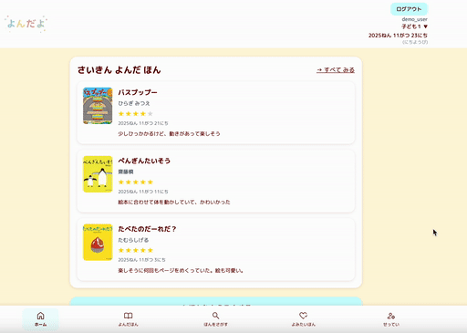
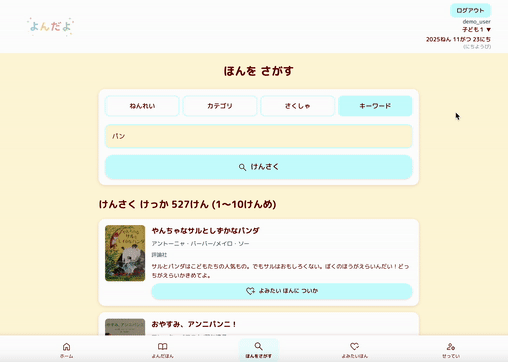
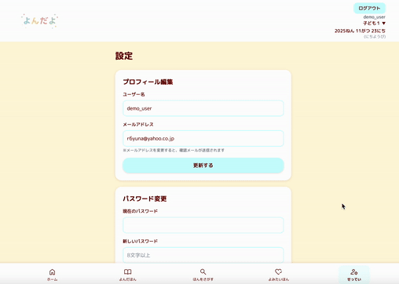
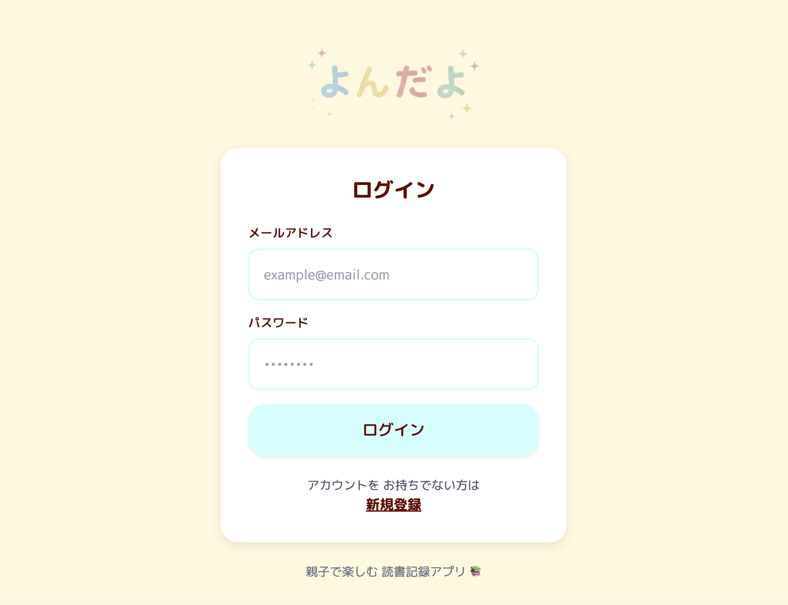

# よんだよ
**親子で楽しめる読み聞かせ記録アプリ** 
読み聞かせで読んだ絵本を記録していくシンプルなアプリです。 

🌐 **デモURL**　https://yondayo-steel.vercel.app/ 
メールアドレス：r6yuna@yahoo.co.jp 
パスワード：Sakutai2025 
※バグがあるため、ログイン後にリロードしてください。
※コードレビューの間だけ、このアドレスでご確認ください。

**＜ アプリの特徴 ＞** 
＊ 兄弟ごとに記録を取ることができます。 
＊ 読書記録の入力をサポートします。 
　 (楽天APIと連携をしているので、タイトルの入力だけで簡単に絵本の情報を取得できます。) 
＊ 楽天APIを使って、絵本を検索することができます。 
＊ 気になった本はブックマークも可能です。 
＊ スタンプカードで子どもの読書意欲も掻き立てます。 

---

## 開発背景
現在、3歳と1歳の子どもにたくさんの絵本を読み聞かせをするなかで 
下記のような課題を感じていました。

1. 年齢に合わせた絵本を数多ある中から選ぶのが難しい
2. これまで読んだ本を図書館に返してしまうと忘れてしまう  
3. 子どもと一緒に楽しめるようにしたい（読書習慣の獲得）

この課題を解決するために「よんだよ」は生まれました。

---

## 主な機能

<table>
  <tr>
    <th width="50%">ホーム画面(スタンプ機能)</th>
    <th width="50%">読書記録管理</th>
  </tr>
  <tr>
    <td align="center"></td>
    <td align="center"></td>
  </tr>
  <tr>
    <td>最新3件の読書記録とスタンプカードを表示。登録をするとスタンプを自動で追加。ホーム画面からも登録可能。</td>
    <td>読んだ本の数の表示。履歴検索、並び替え。楽天booksAPIによる入力サポート</td>
  </tr>
</table>

<table>
  <tr>
    <th width="50%">検索機能</th>
    <th width="50%">未読本管理</th>
  </tr>
  <tr>
    <td align="center"></td>
    <td align="center"></td>
  </tr>
  <tr>
    <td>楽天booksのAPIと連携。年齢、カテゴリー、作者、フリーのキーワードで検索が可能</td>
    <td>検索機能の結果からボタン１つで読みたい本に登録</td>
  </tr>
</table>

<table>
  <tr>
    <th width="50%">アカウント管理</th>
    <th width="50%">認証機能</th>
  </tr>
  <tr>
    <td align="center"></td>
    <td align="center"></td>
  </tr>
  <tr>
    <td>ユーザー情報、メールアドレスやパスワードの変更、子どもの情報の変更や追加</td>
    <td>Supabase Authによるメール認証。新規登録時にメール確認、ログイン後はセッション管理で安全にアクセス。</td>
  </tr>
</table>

※子どもごとに切り替えて管理が可能

---
| Category | Technology Stack |
|----------|------------------|
| Frontend | Next.js 15 (App Router), React 19, TypeScript, Tailwind CSS |
| Backend  | Supabase (PostgreSQL, Authentication, RLS) |
| External API | Rakuten Books API |
| Version Control | GitHub, Git |
| Infrastructure | Vercel |
| Design | Figma, Google Fonts, Canva |
| Code Quality | ESLint |

---
## ER図

## デザイン
https://www.figma.com/design/kD0HKZz5jdbxIvEPZBxFcX/%E3%82%88%E3%82%93%E3%81%A0%E3%82%88?node-id=0-1&t=Uzq4vypSRA5cTtgf-1
(開発当初のデザインです)

---
## 今後の展望
- ISBNコードを利用した図書登録ができる機能の追加   
- AIを活用したおすすめ機能の追加
  - 傾向を掴んで、本の登録完了時にポップアップで1冊表示
  - チャットで回答
- 検索結果の並び替え機能の追加
- ログイン後のバグ修正
